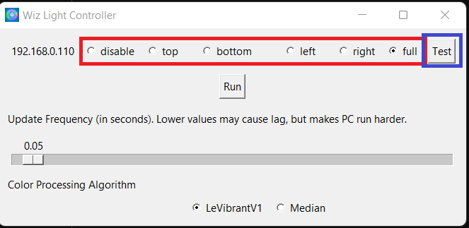

# Philips Wiz Screen Sync
[](https://www.youtube.com/watch?v=qvOY2ONg3P0)


This project allows your program to search your network for Philips Wiz lights and sync them with your screen.

The program is structured as a simple GUI that allows you to choose which parts of your screen to sync with which lights. A few key features are highlighted below:



- The blue square surrounds the `Test` button. This button will cause the lights to flicker. This is useful for identifying which light corresponds to which IP address when you're setting things up. 

- The red square allows you to choose which part of the screen each light should sync with. You can choose from the following options: "Full", "Left Half", "Right Half", "Top Half", "Bottom Half". 

- The `Run` button at the bottom of the app starts the screen syncing process. Once this is clicked, each selected light will start mirroring the colors of its assigned screen area. However, please note that this feature is currently a little buggy. Once the screen syncing process has been started, you won't be able to minimize the app window. We're working on fixing this in future updates!

## Installation

If you're a first time user and you don't want to compile the code from source, you can simply download the ready-to-use executable file. Follow these steps:

1. Navigate to the [releases section](https://github.com/enochlev/PhilipsWizScreenSync/releases) **on the right-hand side** of the GitHub page.
2. Find the latest release and download the .exe file attached to it.
3. Run the downloaded file to start using the Philips Wiz Screen Sync application.

**Note: be sure that you are connected to the same router as the lights are.

** Yet another Note: This is my first release and I will maintain this more, add compatibilities if I get support.


If you're interested in developing this project further, you can clone the repository by running:

```bash
git clone https://github.com/enochlev/PhilipsWizScreenSync.git
```

## Compilation

For developers who want to compile the application from the source code, you need to have Python installed in your system. Here are the steps to compile it:

1. Clone the repository to your local machine:

   ```bash
   git clone https://github.com/enochlev/PhilipsWizScreenSync.git
   ```
2. Navigate to the cloned directory:

   ```bash
   cd PhilipsWizScreenSync
   ```
3. Install the required Python packages:

   ```bash
   pip install -r requirements.txt
   ```
4. Run the PyInstaller to compile the script into an executable file:

   ```bash
   pyinstaller --onefile --noconsole -n "Screen Sync" -i icon.ico --add-data "icon.ico;." --add-data "icon.gif;." pythonLights.py

   ```
5. You'll find the compiled executable in the `dist` directory. 

Enjoy your new immersive lighting experience with Philips Wiz Screen Sync!
